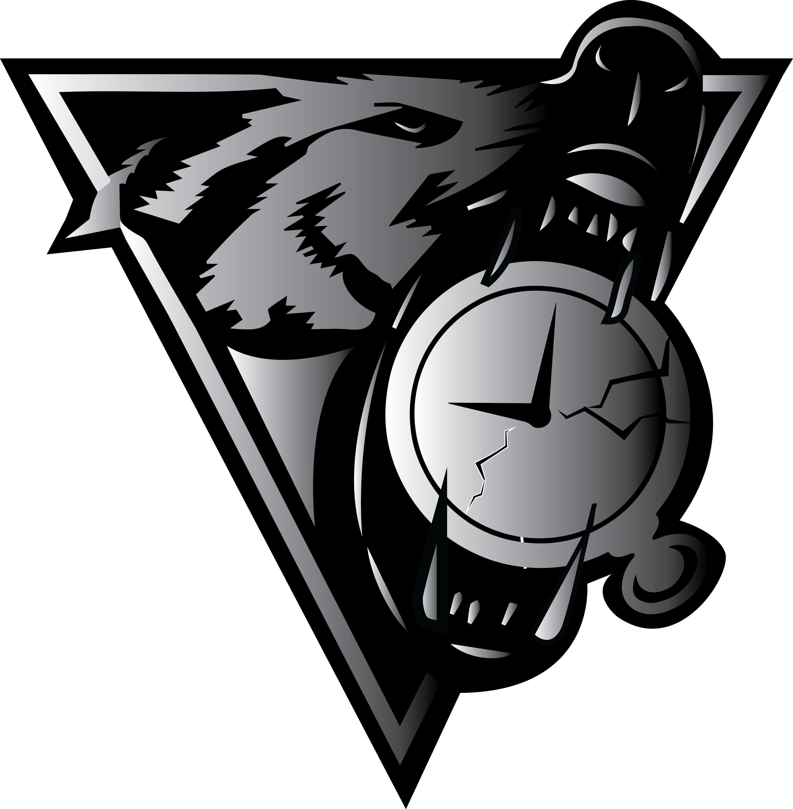

# dfTimewolf

A framework for orchestrating forensic collection, processing and data export.

dfTimewolf consists of collectors, processors and exporters (modules) that pass
data on to one another. How modules are orchestrated is defined in predefined
"recipes".

[:octicons-mark-github-16: Find us on GitHub](https://github.com/log2timeline/dftimewolf){ .md-button }

