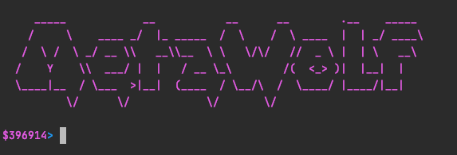
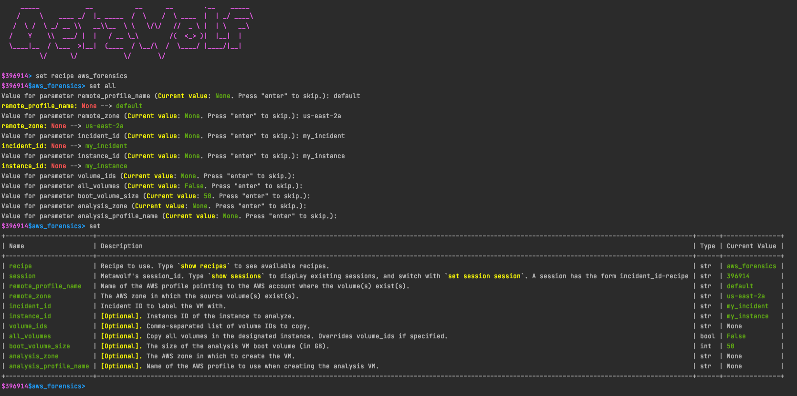
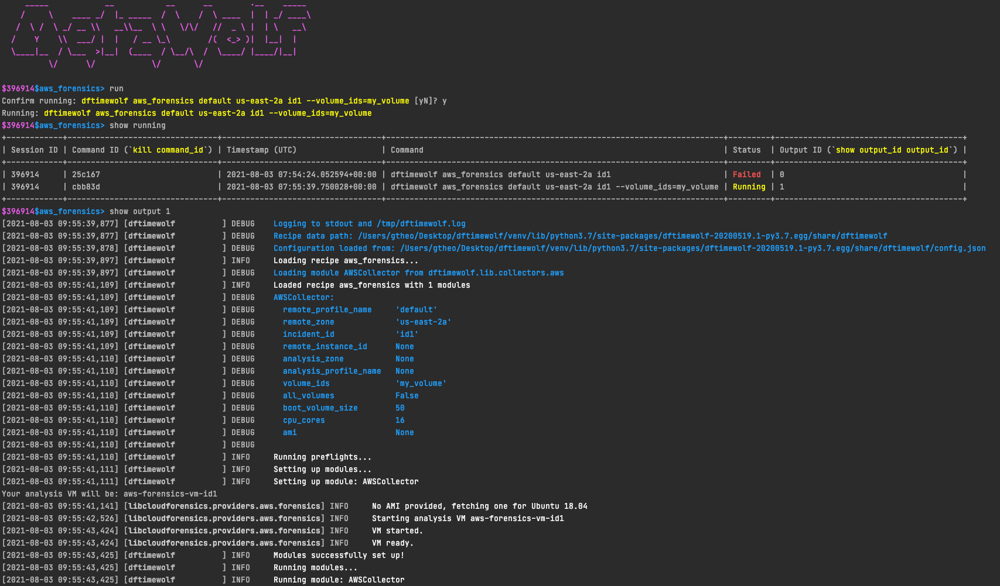

# Metawolf

Metawolf is a meterpreter-like shell for DFTimewolf. It allows you to browse, configure and run available recipes. Metawolf is sessionized, meaning you can have various sessions with various configurations and run multiple recipes at a time.



## Using Metawolf

First of all, open a metawolf shell by running:

```
python dftimewolf/metawolf/metawolf.py
```

### Sessions

`new`: Create a new Metawolf session.

`set -s[ession] xxx`: Set the current session to session `xxx`.

`show -s[essions]`: Show existing Metawolf sessions, including:
  - Any recipe in use in the session.
  - The status of the latest recipe run for that session.

### Parameters

`set` is the main interaction point of Metawolf. It is used to:
- Set which recipe to use
- Set the recipe's parameters
- Set any other Metawolf parameter

Currently, the following syntaxes are supported:

`set`: Display current settable parameters with a short description.

`set xxx yyy`: Set parameter `xxx` with value `yyy`. This only works if `xxx` is a settable parameter (i.e. if it is displayed in the output of the `set` command).

`set -r[ecipe] xxx`: Set the current recipe to recipe `xxx`.

`set -a[ll]`: If a recipe is set, `set -a` loops through the recipe's parameters and prompts you to enter a value for each parameter. Inputs are verified against the expected parameter's type.



### Recipes

Once a recipe is loaded and its parameters set, the following actions are available:

`run`: Run the recipe with the current parameters.

`kill xxx`: Kill currently running recipe whose command identifier is `xxx`.

### Outputs

To monitor a running recipe:

`show -rn[-running]`: Show various information about running recipes. Available information:
  - `session_id`: The session ID this recipe run belongs to.
  - `command_id`: A command identifier for the recipe. This is mainly useful to e.g. `kill` a recipe run.
  - `timestamp`: Timestamp at which the recipe was run.
  - `command`: The full DFTimewolf command corresponding to the recipe run.
  - `status`: The status of the recipe run. Can be one of `[Running, Completed, Failed, Interrupted]`.
  - `output_id`: A simple identifier linking a recipe run to its output. This is used to display the current output of the recipe run.

`show -o[output] output_id`: Display the current output of the recipe run.

`show -rs[-recipes]`: Show DFTimewolf available recipes.

`show -r[ecipe] recipe_name`: Show details about a particular recipe.



### Other features

`quit`: Quit Metawolf.

`clean`: Clean the current recipe run data.

`clear`: Clean the current settables values.

`reload`: Reload the recipe's default arguments' values.

Metawolf uses `cmd2`, so features of `cmd2` are available, such as `help` or history of inputs.

## Metawolf's sessions

Metawolf saves its current state in a JSON file formatted as follow:

```json
{
	"last_active_session": "session", // Session ID of the latest active session
	"session_id_1": {
		"last_active_recipe": "recipe", // Recipe name of the latest active recipe
		"recipe": {
			// Recipe details
		},
		"processes": {
			"command_id": {
				// Processes details
			}
		}
	},
	"session_id_2": {
		"..."
	}
}
```

Any input processed by Metawolf will trigger the session file to be updated with the latest available information. If quitting Metawolf while processes are still running, Metawolf will offer you the option to keep processes running in the background. If you choose to do so, upon restarting Metawolf, Metawolf will attempt to retrieve the process from the system to allow live tracking.
