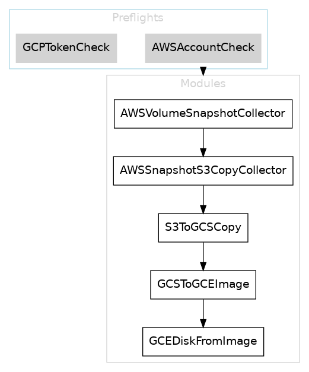
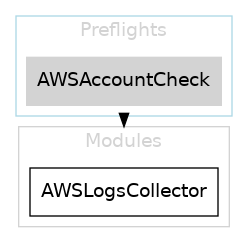
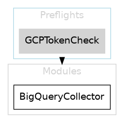
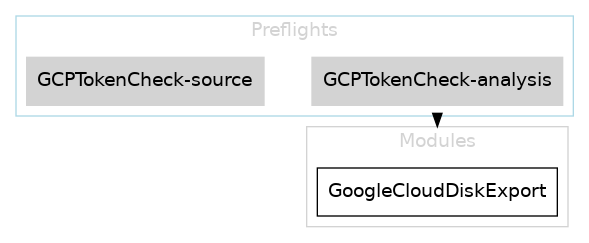
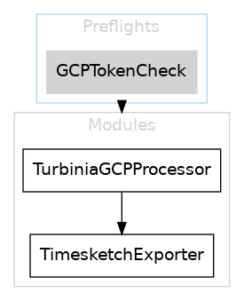
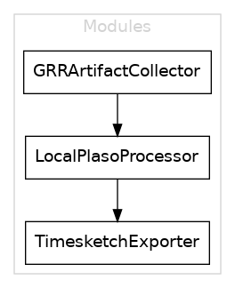
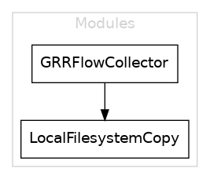
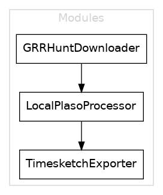
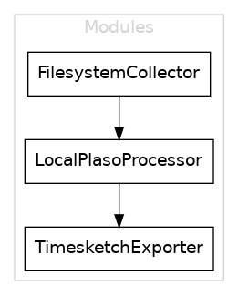
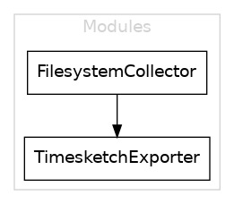

# Recipe list

This is an auto-generated list of dfTimewolf recipes.

To regenerate this list, from the repository root, run:

```
pipenv install --dev
python docs/generate_recipe_doc.py data/recipes
```

---
## `aws_disk_to_gcp`

Copies EBS volumes from within AWS, and transfers them to GCP.

**Details:**

Copies EBS volumes from within AWS, and transfers them to GCP.

Modules: `AWSVolumeSnapshotCollector`, `AWSSnapshotS3CopyCollector`, `S3ToGCSCopy`, `GCSToGCEImage`, `GCEDiskFromImage`

**Module graph**



----

## `aws_forensics`

Copies a volume from an AWS account to an analysis VM.

**Details:**

Copies a volume from an AWS account, creates an analysis VM, and attaches the copied volume to it.

Modules: `AWSCollector`

**Module graph**


----

## `aws_logging_collect`

Collects logs from an AWS account and dumps on the filesystem.

**Details:**

Collects logs from an AWS account and dumps on the filesystem.

Modules: `AWSLogsCollector`

**Module graph**



----

## `aws_turbinia_ts`

Copies EBS volumes from within AWS, transfers them to GCP, analyses with turbinia and outputs the results to timesketch.

**Details:**

Copies EBS volumes from within AWS, transfers them to GCP, analyses with turbinia and outputs the results to timesketch.

Modules: `AWSVolumeSnapshotCollector`, `AWSSnapshotS3CopyCollector`, `S3ToGCSCopy`, `GCSToGCEImage`, `GCEDiskFromImage`, `TurbiniaGCPProcessorThreaded`, `TimesketchExporterThreaded`

**Module graph**


----

## `azure_forensics`

Copies a disk from an Azure account to an analysis VM.

**Details:**

Copies a disk from an Azure account, creates an analysis VM, and attaches the copied disk to it.

Modules: `AzureCollector`

**Module graph**


----

## `bigquery_collect`

Collects results from BigQuery and dumps on the filesystem.

**Details:**

Collects results from BigQuery and dumps on the filesystem.

Modules: `BigQueryCollector`

**Module graph**



----

## `bigquery_ts`

Collects results from BigQuery and loads them to Timesketch.

**Details:**

Collects results from BigQuery and loads them to Timesketch.

Modules: `BigQueryCollector`, `TimesketchExporter`

**Module graph**


----

## `gce_disk_export`

Export disk image from a GCP project to Google Cloud Storage.

**Details:**

Creates a disk image from a Google compute persistence disks, compress the images and export them to Google Cloud Storage.

The exported images names are appended by .tar.gz.

The service account [PROJECT-NR]@cloudbuild.gserviceaccount.com in the source project or in analysis project, if analysis project is provided, must have the IAM role [Srorage Admin] on the destination storage bucket/folder.

Modules: `GoogleCloudDiskExport`

**Module graph**



----

## `gcp_forensics`

Copies disk from a GCP project to an analysis VM.

**Details:**

Copies a disk from a project to another, creates an analysis VM, and attaches the copied disk to it.

Modules: `GoogleCloudCollector`

**Module graph**


----

## `gcp_logging_cloudaudit_ts`

Collects GCP logs from a project and exports them to Timesketch.

**Details:**

Collects GCP logs from a project and exports them to Timesketch.

Modules: `GCPLogsCollector`, `GCPLoggingTimesketch`, `TimesketchExporter`

**Module graph**


----

## `gcp_logging_cloudsql_ts`

Collects GCP logs from Cloud SQL instances for a project and exports them to Timesketch.

**Details:**

Collects GCP logs from Cloud SQL instances for a project and exports them to Timesketch.

Modules: `GCPLogsCollector`, `GCPLoggingTimesketch`, `TimesketchExporter`

**Module graph**


----

## `gcp_logging_collect`

Collects logs from a GCP project and dumps on the filesystem.

**Details:**

Collects logs from a GCP project and dumps on the filesystem.

Modules: `GCPLogsCollector`

**Module graph**


----

## `gcp_logging_gce_instance_ts`

GCP Instance Cloud Audit to Timesketch

**Details:**

Loads GCP Cloud Audit Logs for a GCE instance into Timesketch.

Modules: `GCPLogsCollector`, `GCPLoggingTimesketch`, `TimesketchExporter`

**Module graph**


----

## `gcp_logging_gce_ts`

Loads GCP Cloud Audit Logs for GCE into Timesketch

**Details:**

Loads GCP Cloud Audit Logs for GCE into Timesketch.

Modules: `GCPLogsCollector`, `GCPLoggingTimesketch`, `TimesketchExporter`

**Module graph**


----

## `gcp_turbinia_disk_copy_ts`

Imports a remote GCP persistent disk, processes it with Turbinia and sends results to Timesketch.

**Details:**

Imports a remote GCP persistent disk and sends to Turbinia and Timesketch.

- Copies a disk from a remote GCP project
- Creates Turbinia processing requests
- Downloads and sends results to Timesketch.

It will start an analysis VM with the attached disk. If the target disk is already in the same project as Turbinia you can use the `gcp_turbinia_ts` recipe.

Modules: `GoogleCloudCollector`, `TurbiniaGCPProcessor`, `TimesketchExporter`

**Module graph**


----

## `gcp_turbinia_ts`

Processes an existing GCP persistent disk in the Turbinia project and sends results to Timesketch.

**Details:**

Process a GCP persistent disk with Turbinia and send output to Timesketch.

This processes a disk that is already in the project where Turbinia exists. If you want to copy the disk from another project, use the gcp_turbinia_disk_copy_ts recipe.

Modules: `TurbiniaGCPProcessor`, `TimesketchExporter`

**Module graph**



----

## `gcp_turbinia_ts_threaded`

Processes existing GCP persistent disks in the Turbinia project and sends results to Timesketch.

**Details:**

Process GCP persistent disks with Turbinia and send output to Timesketch.

This processes disks that are already in the project where Turbinia exists. If you want to copy disks from another project, use the gcp_turbinia_disk_copy_ts recipe.

Modules: `TurbiniaGCPProcessorThreaded`, `TimesketchExporterThreaded`

**Module graph**


----

## `grr_artifact_grep`

Fetches ForensicArtifacts from GRR hosts and runs grep with a list of keywords on them.

**Details:**

Collect artifacts from hosts using GRR.

- Collect a predefined list of artifacts from hosts using GRR
- Process them locally with grep to extract keywords

Modules: `GRRArtifactCollector`, `GrepperSearch`

**Module graph**


----

## `grr_artifact_ts`

Fetches default artifacts from a list of GRR hosts, processes them with plaso, and sends the results to Timesketch.

**Details:**

Collect artifacts from hosts using GRR.

- Collect a predefined list of artifacts from hosts using GRR
- Process them with a local install of plaso
- Export them to a Timesketch sketch

Modules: `GRRArtifactCollector`, `LocalPlasoProcessor`, `TimesketchExporter`

**Module graph**



----

## `grr_files_collect`

Fetches specific files from one or more GRR hosts.

**Details:**

Fetches specific files from one or more GRR hosts.

Modules: `GRRFileCollector`, `LocalFilesystemCopy`

**Module graph**


----

## `grr_flow_collect`

Download GRR flows.

Download a GRR flow's results to the local filesystem.

**Details:**

Download GRR flows.

Download a GRR flow's results to the local filesystem.

Modules: `GRRFlowCollector`, `LocalFilesystemCopy`

**Module graph**



----

## `grr_hunt_artifacts`

Starts a GRR hunt for the default set of artifacts.

**Details:**

Starts a GRR artifact hunt and provides the Hunt ID to the user.
Feed the Hunt ID to grr_huntresults_plaso_timesketch to process results through plaso and send them to Timesketch.

Modules: `GRRHuntArtifactCollector`

**Module graph**


----

## `grr_hunt_file`

Starts a GRR hunt for a list of files.

**Details:**

Starts a GRR hunt for a list of files and provides a Hunt ID to the user.
Feed the Hunt ID to grr_huntresults_plaso_timesketch to process results through plaso and send them to Timesketch.

Modules: `GRRHuntFileCollector`

**Module graph**


----

## `grr_huntresults_ts`

Fetches the findings of a GRR hunt, processes them with plaso, and sends the results to Timesketch.

**Details:**

Download the results of a GRR hunt and process them.

- Collect results of a hunt given its Hunt ID
- Processes results with a local install of plaso
- Exports processed items to a new Timesketch sketch

Modules: `GRRHuntDownloader`, `LocalPlasoProcessor`, `TimesketchExporter`

**Module graph**



----

## `grr_timeline_ts`

Runs a TimelineFlow on a set of GRR hosts, processes results with plaso, and sends the timeline to Timesketch

**Details:**

Runs a TimelineFlow on a set of GRR hosts, processes results with plaso, and sends the timeline to Timesketch

Modules: `GRRTimelineCollector`, `LocalPlasoProcessor`, `TimesketchExporter`, `TimesketchEnhancer`

**Module graph**


----

## `plaso_ts`

Processes a list of file paths using plaso and sends results to Timesketch.

**Details:**

Processes a list of file paths using plaso and sends results to Timesketch.

- Collectors collect from a path in the FS
- Processes them with a local install of plaso
- Exports them to a new Timesketch sketch

Modules: `FilesystemCollector`, `LocalPlasoProcessor`, `TimesketchExporter`

**Module graph**



----

## `upload_ts`

Uploads a CSV or Plaso file to Timesketch.

**Details:**

Uploads a CSV or Plaso file to Timesketch.

Modules: `FilesystemCollector`, `TimesketchExporter`

**Module graph**



----

## `upload_turbinia`

Uploads arbitrary files to Turbinia.

**Details:**

['Uploads arbitrary files to Turbinia']

Modules: `FilesystemCollector`, `LocalFilesystemCopy`, `SCP-Upload`, `TurbiniaArtifactProcessor`, `SCP-Download`

**Module graph**


----

## `upload_web_ts`

Uploads a CSV/JSONL or Plaso file to Timesketch.

**Details:**

Uploads a CSV or Plaso file to Timesketch and executes web artifact analyzers on the uploaded data

Modules: `FilesystemCollector`, `TimesketchExporter`, `TimesketchEnhancer`

**Module graph**


----

## `vt_evtx`

Fetches the EVTX from VirusTotal sandbox run for a specific hash.

**Details:**

Fetches the EVTX from VirusTotal for a specific hash, processes it with Plaso.

Modules: `VTCollector`, `LocalPlasoProcessor`

**Module graph**


----

## `vt_evtx_ts`

Fetches the EVTX from VirusTotal sandbox run for a specific hash and upload it to Timesketch.

**Details:**

Fetches the EVTX from VirusTotal for a specific hash, processes it with Plaso and upload it to Timesketch

Modules: `VTCollector`, `LocalPlasoProcessor`, `TimesketchExporter`

**Module graph**


----

## `vt_pcap`

Fetches the PCAP from VirusTotal sandbox run for a specific hash

**Details:**

Fetches the PCAP from VirusTotalfor a specific hash.

Modules: `VTCollector`, `LocalFilesystemCopy`

**Module graph**


----

## `workspace_logging_collect`

Collects Workspace Audit logs and dumps them on the filesystem.

**Details:**

Collects logs from Workspace Audit log and dumps them on the filesystem.

Modules: `WorkspaceAuditCollector`

**Module graph**


----

## `workspace_meet_ts`

Collects Meet records and adds to Timesketch

**Details:**

Collects Google Workspace audit records for a Google Meet and adds them to Timesketch.

Modules: `WorkspaceAuditCollector`, `WorkspaceAuditTimesketch`, `TimesketchExporter`

**Module graph**


----

## `workspace_user_activity_ts`

Collects records and adds to Timesketch

**Details:**

Collects records for a Workspace user and adds them to Timesketch.

Modules: `WorkspaceAuditCollector-Login`, `WorkspaceAuditCollector-Drive`, `WorkspaceAuditCollector-Token`, `WorkspaceAuditCollector-Chrome`, `WorkspaceAuditCollector-CAA`, `WorkspaceAuditCollector-DataStudio`, `WorkspaceAuditCollector-GroupsEnterprise`, `WorkspaceAuditCollector-Calendar`, `WorkspaceAuditCollector-Chat`, `WorkspaceAuditCollector-GCP`, `WorkspaceAuditCollector-Groups`, `WorkspaceAuditCollector-Meet`, `WorkspaceAuditCollector-UserAccounts`, `WorkspaceAuditTimesketch`, `TimesketchExporter`

**Module graph**


----

## `workspace_user_drive_ts`

Collects Drive records and adds to Timesketch

**Details:**

Collects drive records for a Workspace user and adds them to Timesketch.

Modules: `WorkspaceAuditCollector`, `WorkspaceAuditTimesketch`, `TimesketchExporter`

**Module graph**


----

## `workspace_user_login_ts`

Collects login records and adds to Timesketch

**Details:**

Collects login records for a Workspace user and adds them to Timesketch.

Modules: `WorkspaceAuditCollector`, `WorkspaceAuditTimesketch`, `TimesketchExporter`

**Module graph**


----

