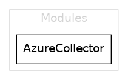
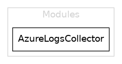
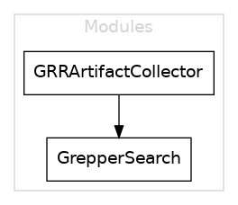
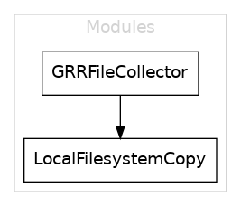
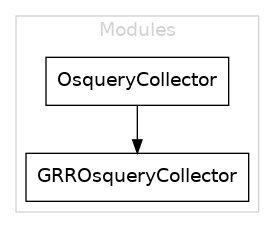
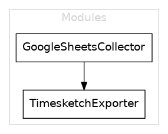
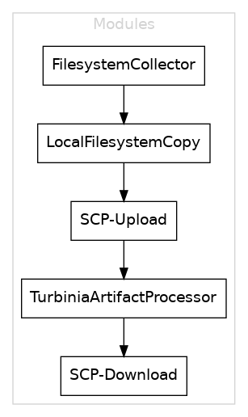
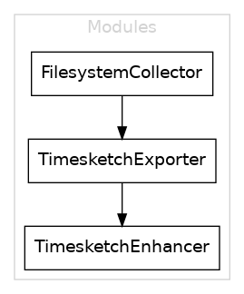
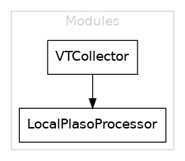
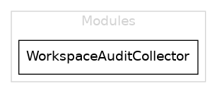

# Recipe list

This is an auto-generated list of dfTimewolf recipes.

To regenerate this list, from the repository root, run:

```
pipenv install --dev
python docs/generate_recipe_doc.py data/recipes
```

---
## `aws_disk_to_gcp`

Copies EBS volumes from within AWS, and transfers them to GCP.

**Details:**

Copies EBS volumes from within AWS by pushing them to an AWS S3 bucket. The S3 bucket is then copied to a Google Cloud Storage bucket, from which a GCP Disk Image and fnially a GCP Persistent Disk are created. This operation happens in the cloud and doesn't touch the local workstation on which the recipe is run.

**CLI parameters:**

Parameter|Default value|Description
---------|-------------|-----------
`aws_region`|`None`|AWS region containing the EBS volumes.
`gcp_zone`|`None`|Destination GCP zone in which to create the disks.
`volumes`|`None`|Comma separated list of EBS volume IDs (e.g. vol-xxxxxxxx).
`aws_bucket`|`None`|AWS bucket for image storage.
`gcp_bucket`|`None`|GCP bucket for image storage.
`--subnet`|`None`|AWS subnet to copy instances from, required if there is no default subnet in the volume region.
`--gcp_project`|`None`|Destination GCP project.
`--aws_profile`|`None`|Source AWS profile.
`--incident_id`|`None`|Incident ID (used for Timesketch description).
`--run_all_jobs`|`False`|Run all Turbinia processing jobs instead of a faster subset.
`--sketch_id`|`None`|Timesketch sketch to which the timeline should be added.
`--token_password`|`''`|Optional custom password to decrypt Timesketch credential file with.
`--wait_for_timelines`|`True`|Whether to wait for Timesketch to finish processing all timelines.


Modules: `AWSVolumeSnapshotCollector`, `AWSSnapshotS3CopyCollector`, `S3ToGCSCopy`, `GCSToGCEImage`, `GCEDiskFromImage`

**Module graph**


----

## `aws_forensics`

Copies a volume from an AWS account to an analysis VM.

**Details:**

Copies a volume from an AWS account, creates an analysis VM in AWS (with a startup script containing installation instructions for basic forensics tooling), and attaches the copied volume to it.

**CLI parameters:**

Parameter|Default value|Description
---------|-------------|-----------
`remote_profile_name`|`None`|Name of the AWS profile pointing to the AWS account where the volume(s) exist(s).
`remote_zone`|`None`|The AWS zone in which the source volume(s) exist(s).
`incident_id`|`None`|Incident ID to label the VM with.
`--instance_id`|`None`|Instance ID of the instance to analyze.
`--volume_ids`|`None`|Comma-separated list of volume IDs to copy.
`--all_volumes`|`False`|Copy all volumes in the designated instance. Overrides volume_ids if specified.
`--boot_volume_size`|`50`|The size of the analysis VM boot volume (in GB).
`--analysis_zone`|`None`|The AWS zone in which to create the VM.
`--analysis_profile_name`|`None`|Name of the AWS profile to use when creating the analysis VM.


Modules: `AWSCollector`

**Module graph**


----

## `aws_logging_collect`

Collects logs from an AWS account and dumps the results to the filesystem.

**Details:**

Collects logs from an AWS account using a specified query filter and date ranges, and dumps them on the filesystem.

**CLI parameters:**

Parameter|Default value|Description
---------|-------------|-----------
`zone`|`None`|Default availability zone for API queries.
`--profile_name`|`'default'`|Name of the AWS profile to collect logs from.
`--query_filter`|`None`|Filter expression to use to query logs.
`--start_time`|`None`|Start time for the query.
`--end_time`|`None`|End time for the query.


Modules: `AWSLogsCollector`

**Module graph**


----

## `aws_turbinia_ts`

Copies EBS volumes from within AWS, transfers them to GCP, analyses with Turbinia and exports the results to Timesketch.

**Details:**

Copies EBS volumes from within AWS, uses buckets and cloud-to-cloud operations to transfer the data to GCP. Once in GCP, a persistent disk is created and a job is added to the Turbinia queue to start analysis. The resulting Plaso file is then exported to Timesketch.

**CLI parameters:**

Parameter|Default value|Description
---------|-------------|-----------
`aws_region`|`None`|AWS region containing the EBS volumes.
`gcp_zone`|`None`|Destination GCP zone in which to create the disks.
`volumes`|`None`|Comma separated list of EBS volume IDs (e.g. vol-xxxxxxxx).
`aws_bucket`|`None`|AWS bucket for image storage.
`gcp_bucket`|`None`|GCP bucket for image storage.
`--subnet`|`None`|AWS subnet to copy instances from, required if there is no default subnet in the volume region.
`--gcp_project`|`None`|Destination GCP project.
`--aws_profile`|`None`|Source AWS profile.
`--incident_id`|`None`|Incident ID (used for Timesketch description).
`--run_all_jobs`|`False`|Run all Turbinia processing jobs instead of a faster subset.
`--sketch_id`|`None`|Timesketch sketch to which the timeline should be added.
`--token_password`|`''`|Optional custom password to decrypt Timesketch credential file with.
`--turbinia_zone`|`'us-central1-f'`|Zone Turbinia is located in
`--wait_for_timelines`|`True`|Whether to wait for Timesketch to finish processing all timelines.


Modules: `AWSVolumeSnapshotCollector`, `AWSSnapshotS3CopyCollector`, `S3ToGCSCopy`, `GCSToGCEImage`, `GCEDiskFromImage`, `TurbiniaGCPProcessor`, `TimesketchExporter`

**Module graph**


----

## `azure_forensics`

Copies a disk from an Azure account to an analysis VM.

**Details:**

Copies a disk from an Azure account, creates an analysis VM in Azure (with a startup script containing installation instructions for basic forensics tooling), and attaches the copied disk to it.

**CLI parameters:**

Parameter|Default value|Description
---------|-------------|-----------
`remote_profile_name`|`None`|Name of the Azure profile pointing to the Azure account where the disk(s) exist(s).
`analysis_resource_group_name`|`None`|The Azure resource group name in which to create the VM.
`incident_id`|`None`|Incident ID to label the VM with.
`ssh_public_key`|`None`|A SSH public key string to add to the VM (e.g. `ssh-rsa AAAAB3NzaC1y...`).
`--instance_name`|`None`|Instance name of the instance to analyze.
`--disk_names`|`None`|Comma-separated list of disk names to copy.
`--all_disks`|`False`|Copy all disks in the designated instance. Overrides `disk_names` if specified.
`--boot_disk_size`|`50`|The size of the analysis VM's boot disk (in GB).
`--analysis_region`|`None`|The Azure region in which to create the VM.
`--analysis_profile_name`|`None`|Name of the Azure profile to use when creating the analysis VM.


Modules: `AzureCollector`

**Module graph**



----

## `azure_logging_collect`

Collects logs from an Azure subscription and dumps the results to the filesystem.

**Details:**

Collects logs from an Azure subscription using a specified filter, and dumps them on the filesystem.

**CLI parameters:**

Parameter|Default value|Description
---------|-------------|-----------
`subscription_id`|`None`|Subscription ID for the subscription to collect logs from.
`filter_expression`|`None`|A filter expression to use for the log query, must specify at least a start date like "eventTimestamp ge '2022-02-01'"
`--profile_name`|`None`|A profile name to use when looking for Azure credentials.


Modules: `AzureLogsCollector`

**Module graph**



----

## `bigquery_collect`

Collects results from BigQuery and dumps them on the filesystem.

**Details:**

Collects results from BigQuery in a GCP project and dumps them in JSONL on the local filesystem.

**CLI parameters:**

Parameter|Default value|Description
---------|-------------|-----------
`project_name`|`None`|Name of GCP project to collect logs from.
`query`|`None`|Query to execute.
`description`|`None`|Human-readable description of the query.


Modules: `BigQueryCollector`

**Module graph**


----

## `bigquery_ts`

Collects results from BigQuery and uploads them to Timesketch.

**Details:**

Collects results from BigQuery in JSONL form, dumps them to the filesystem, and uploads them to Timesketch.

**CLI parameters:**

Parameter|Default value|Description
---------|-------------|-----------
`project_name`|`None`|Name of GCP project to collect logs from.
`query`|`None`|Query to execute.
`description`|`None`|Human-readable description of the query.
`--incident_id`|`None`|Incident ID (used for Timesketch description).
`--sketch_id`|`None`|Timesketch sketch to which the timeline should be added.
`--token_password`|`''`|Optional custom password to decrypt Timesketch credential file with.
`--wait_for_timelines`|`True`|Whether to wait for Timesketch to finish processing all timelines.


Modules: `BigQueryCollector`, `TimesketchExporter`

**Module graph**


----

## `gce_disk_export`

Export a disk image from a GCP project to a Google Cloud Storage bucket.

**Details:**

Creates a disk image from Google Compute persistent disks, compresses the images, and exports them to Google Cloud Storage.

The exported images names are appended by `.tar.gz.`

As this export happens through a Cloud Build job, the default service account `[PROJECT-NUMBER]@cloudbuild.gserviceaccount.com` in the source or analysis project (if provided) must have the IAM role `[Storage Admin]` on their corresponding project's storage bucket/folder.

**CLI parameters:**

Parameter|Default value|Description
---------|-------------|-----------
`source_project_name`|`None`|Source project containing the disk to export.
`gcs_output_location`|`None`|Google Cloud Storage parent bucket/folder to which to export the image.
`--analysis_project_name`|`None`|Project where the disk image is created then exported. If not provided, the image is exported to a bucket in the source project.
`--source_disk_names`|`None`|Comma-separated list of disk names to export. If not provided, disks attached to `remote_instance_name` will be used.
`--remote_instance_name`|`None`|Instance in source project to export its disks. If not provided, `disk_names` will be used.
`--all_disks`|`False`|If True, copy all disks attached to the `remote_instance_name` instance. If False and `remote_instance_name` is provided, it will select the instance's boot disk.
`--exported_image_name`|`None`|Name of the output file, must comply with `^[A-Za-z0-9-]*$` and `'.tar.gz'` will be appended to the name. If not provided or if more than one disk is selected, the exported image will be named `exported-image-{TIMESTAMP('%Y%m%d%H%M%S')}`.


Modules: `GoogleCloudDiskExport`

**Module graph**


----

## `gcp_forensics`

Copies disk from a GCP project to an analysis VM.

**Details:**

Copies a persistent disk from a GCP project to another, creates an analysis VM (with a startup script containing installation instructions for basic forensics tooling) in the destination project, and attaches the copied GCP persistent disk to it.

**CLI parameters:**

Parameter|Default value|Description
---------|-------------|-----------
`remote_project_name`|`None`|Name of the project containing the instance / disks to copy.
`--analysis_project_name`|`None`|Name of the project where the analysis VM will be created and disks copied to.
`--incident_id`|`None`|Incident ID to label the VM with.
`--instance`|`None`|Name of the instance to analyze.
`--disks`|`None`|Comma-separated list of disks to copy from the source GCP project (if `instance` not provided).
`--all_disks`|`False`|Copy all disks in the designated instance. Overrides `disk_names` if specified.
`--stop_instance`|`False`|Stop the designated instance after copying disks.
`--create_analysis_vm`|`True`|Create an analysis VM in the destination project.
`--cpu_cores`|`4`|Number of CPU cores of the analysis VM.
`--boot_disk_size`|`50.0`|The size of the analysis VM boot disk (in GB).
`--boot_disk_type`|`'pd-standard'`|Disk type to use [pd-standard, pd-ssd].
`--zone`|`'us-central1-f'`|The GCP zone where the Analysis VM and copied disks will be created.


Modules: `GoogleCloudCollector`

**Module graph**


----

## `gcp_logging_cloudaudit_ts`

Collects GCP logs from a project and exports them to Timesketch.

**Details:**

Collects GCP logs from a project and exports them to Timesketch. Some light processing is made to translate the logs into something Timesketch can process.

**CLI parameters:**

Parameter|Default value|Description
---------|-------------|-----------
`project_name`|`None`|Name of the GCP project to collect logs from.
`start_date`|`None`|Start date (yyyy-mm-ddTHH:MM:SSZ).
`end_date`|`None`|End date (yyyy-mm-ddTHH:MM:SSZ).
`--incident_id`|`None`|Incident ID (used for Timesketch description).
`--sketch_id`|`None`|Timesketch sketch to which the timeline should be added.
`--token_password`|`''`|Optional custom password to decrypt Timesketch credential file with.
`--wait_for_timelines`|`True`|Whether to wait for Timesketch to finish processing all timelines.


Modules: `GCPLogsCollector`, `GCPLoggingTimesketch`, `TimesketchExporter`

**Module graph**


----

## `gcp_logging_cloudsql_ts`

Collects GCP related to Cloud SQL instances in a project and exports them to Timesketch.

**Details:**

Collects GCP related to Cloud SQL instances in a project and exports them to Timesketch. Some light processing is made to translate the logs into something Timesketch can process.

**CLI parameters:**

Parameter|Default value|Description
---------|-------------|-----------
`project_name`|`None`|Name of the GCP project to collect logs from.
`start_date`|`None`|Start date (yyyy-mm-ddTHH:MM:SSZ).
`end_date`|`None`|End date (yyyy-mm-ddTHH:MM:SSZ).
`--incident_id`|`None`|Incident ID (used for Timesketch description).
`--sketch_id`|`None`|Timesketch sketch to which the timeline should be added.
`--token_password`|`''`|Optional custom password to decrypt Timesketch credential file with.
`--wait_for_timelines`|`True`|Whether to wait for Timesketch to finish processing all timelines.


Modules: `GCPLogsCollector`, `GCPLoggingTimesketch`, `TimesketchExporter`

**Module graph**


----

## `gcp_logging_collect`

Collects logs from a GCP project and dumps on the filesystem (JSON). https://cloud.google.com/logging/docs/view/query-library for example queries.

**Details:**

Collects logs from a GCP project and dumps on the filesystem.

**CLI parameters:**

Parameter|Default value|Description
---------|-------------|-----------
`project_name`|`None`|Name of the GCP project to collect logs from.
`filter_expression`|`"resource.type = 'gce_instance'"`|Filter expression to use to query GCP logs. See https://cloud.google.com/logging/docs/view/query-library for examples.


Modules: `GCPLogsCollector`

**Module graph**


----

## `gcp_logging_gce_instance_ts`

GCP Instance Cloud Audit logs to Timesketch

**Details:**

Collects GCP Cloud Audit Logs for a GCE instance and exports them to Timesketch. Some light processing is made to translate the logs into something Timesketch can process.

**CLI parameters:**

Parameter|Default value|Description
---------|-------------|-----------
`project_name`|`None`|Name of the GCP project to collect logs from.
`instance_id`|`None`|Identifier for GCE instance (Instance ID).
`--incident_id`|`None`|Incident ID (used for Timesketch description).
`--sketch_id`|`None`|Timesketch sketch to which the timeline should be added.
`--token_password`|`''`|Optional custom password to decrypt Timesketch credential file with.
`--wait_for_timelines`|`True`|Whether to wait for Timesketch to finish processing all timelines.


Modules: `GCPLogsCollector`, `GCPLoggingTimesketch`, `TimesketchExporter`

**Module graph**


----

## `gcp_logging_gce_ts`

Loads all GCE Cloud Audit Logs in a GCP project into Timesketch.

**Details:**

Loads all GCE Cloud Audit Logs for all instances in a GCP project into Timesketch. Some light processing is made to translate the logs into something Timesketch can process.

**CLI parameters:**

Parameter|Default value|Description
---------|-------------|-----------
`project_name`|`None`|Name of the GCP project to collect logs from.
`start_date`|`None`|Start date (yyyy-mm-ddTHH:MM:SSZ).
`end_date`|`None`|End date (yyyy-mm-ddTHH:MM:SSZ).
`--incident_id`|`None`|Incident ID (used for Timesketch description).
`--sketch_id`|`None`|Timesketch sketch to which the timeline should be added.
`--token_password`|`''`|Optional custom password to decrypt Timesketch credential file with.
`--wait_for_timelines`|`True`|Whether to wait for Timesketch to finish processing all timelines.


Modules: `GCPLogsCollector`, `GCPLoggingTimesketch`, `TimesketchExporter`

**Module graph**


----

## `gcp_turbinia_disk_copy_ts`

Imports a remote GCP persistent disk, processes it with Turbinia and sends results to Timesketch.

**Details:**

Imports a remote GCP persistent disk into an analysis GCP project and sends the result of Turbinia processing to Timesketch.

- Copies a disk from a remote GCP project into an analysis project
- Creates Turbinia processing request to process the imported disk
- Downloads and sends results of the Turbinia processing to Timesketch.

This recipe will also start an analysis VM in the destination project with the attached disk (the same one that Turbinia will have processed). If the target disk is already in the same project as Turbinia, you can use the `gcp_turbinia_ts` recipe.

**CLI parameters:**

Parameter|Default value|Description
---------|-------------|-----------
`remote_project_name`|`None`|Name of the project containing the instance / disks to copy.
`analysis_project_name`|`None`|Name of the project containing the Turbinia instance.
`--turbinia_zone`|`None`|The GCP zone the disk to process and Turbinia workers are in.
`--incident_id`|`None`|Incident ID (used for Timesketch description and to label the VM with).
`--run_all_jobs`|`False`|Run all Turbinia processing jobs instead of a faster subset.
`--sketch_id`|`None`|Timesketch sketch to which the timeline should be added.
`--token_password`|`''`|Optional custom password to decrypt Timesketch credential file with.
`--analysis_vm`|`True`|Create an analysis VM in the destination project.
`--wait_for_timelines`|`True`|Whether to wait for Timesketch to finish processing all timelines.
`--instance`|`None`|Name of the instance to analyze.
`--disks`|`None`|Comma-separated list of disks to copy from the source GCP project (if `instance` not provided).
`--all_disks`|`False`|Copy all disks in the designated instance. Overrides disk_names if specified.
`--stop_instance`|`False`|Stop the designated instance after copying disks.
`--cpu_cores`|`4`|Number of CPU cores of the analysis VM.
`--boot_disk_size`|`50.0`|The size of the analysis VM boot disk (in GB).
`--boot_disk_type`|`'pd-standard'`|Disk type to use [pd-standard, pd-ssd]
`--image_project`|`'ubuntu-os-cloud'`|Name of the project where the analysis VM image is hosted.
`--image_family`|`'ubuntu-1804-lts'`|Name of the image to use to create the analysis VM.


Modules: `GoogleCloudCollector`, `TurbiniaGCPProcessor`, `TimesketchExporter`

**Module graph**


----

## `gcp_turbinia_ts`

Processes existing GCP persistent disks with Turbinia project and sends results to Timesketch.

**Details:**

Process GCP persistent disks with Turbinia and send output to Timesketch.

This processes disks that are already in the project where Turbinia exists. If you want to copy disks from another project, use the `gcp_turbinia_disk_copy_ts` recipe.

**CLI parameters:**

Parameter|Default value|Description
---------|-------------|-----------
`analysis_project_name`|`None`|Name of GCP project the disk exists in.
`turbinia_zone`|`None`|The GCP zone the disk to process (and Turbinia workers) are in.
`disk_names`|`None`|Names of GCP persistent disks to process.
`--incident_id`|`None`|Incident ID (used for Timesketch description).
`--run_all_jobs`|`False`|Run all Turbinia processing jobs instead of a faster subset.
`--sketch_id`|`None`|Timesketch sketch to which the timeline should be added.
`--token_password`|`''`|Optional custom password to decrypt Timesketch credential file with.
`--wait_for_timelines`|`True`|Whether to wait for Timesketch to finish processing all timelines.


Modules: `TurbiniaGCPProcessor`, `TimesketchExporter`

**Module graph**


----

## `grr_artifact_grep`

Fetches ForensicArtifacts from GRR hosts and runs grep with a list of keywords on them.

**Details:**

Collect ForensicArtifacts from hosts using GRR.

- Collect a predefined list of artifacts from hosts using GRR
- Process them locally with grep to extract keywords.

**CLI parameters:**

Parameter|Default value|Description
---------|-------------|-----------
`hostnames`|`None`|Comma-separated list of hostnames or GRR client IDs to process.
`reason`|`None`|Reason for collection.
`keywords`|`None`|Pipe-separated list of keywords to search for (e.g. key1|key2|key3.
`--artifacts`|`None`|Comma-separated list of artifacts to fetch (override default artifacts).
`--extra_artifacts`|`None`|Comma-separated list of artifacts to append to the default artifact list.
`--raw_disk_access`|`False`|Use TSK to fetch artifacts.
`--approvers`|`None`|Emails for GRR approval request.
`--grr_server_url`|`'http://localhost:8000'`|GRR endpoint.
`--verify`|`True`|Whether to verify the GRR TLS certificate.
`--skip_offline_clients`|`False`|Whether to skip clients that are offline.
`--grr_username`|`'admin'`|GRR username.
`--grr_password`|`'admin'`|GRR password.
`--max_file_size`|`5368709120`|Maximum size of files to collect (in bytes).


Modules: `GRRArtifactCollector`, `GrepperSearch`

**Module graph**



----

## `grr_artifact_ts`

Fetches default ForensicArtifacts from a sequence of GRR hosts, processes them with plaso, and sends the results to Timesketch.

**Details:**

Collect artifacts from hosts using GRR.

- Collect a predefined list of artifacts from hosts using GRR
- Process them with a local install of plaso
- Export them to a Timesketch sketch.

The default set of artifacts is defined in the GRRArtifactCollector module (see the `_DEFAULT_ARTIFACTS_*` class attributes in `grr_hosts.py`), and varies per platform.

**CLI parameters:**

Parameter|Default value|Description
---------|-------------|-----------
`hostnames`|`None`|Comma-separated list of hostnames or GRR client IDs to process.
`reason`|`None`|Reason for collection.
`--artifacts`|`None`|Comma-separated list of artifacts to fetch (override default artifacts).
`--extra_artifacts`|`None`|Comma-separated list of artifacts to append to the default artifact list.
`--raw_disk_access`|`False`|Use TSK to fetch artifacts.
`--approvers`|`None`|Emails for GRR approval request.
`--sketch_id`|`None`|Timesketch sketch to which the timeline should be added.
`--wait_for_timelines`|`True`|Whether to wait for Timesketch to finish processing all timelines.
`--analyzers`|`None`|Timesketch analysers to run
`--token_password`|`''`|Optional custom password to decrypt Timesketch credential file with.
`--incident_id`|`None`|Incident ID (used for Timesketch description).
`--grr_server_url`|`'http://localhost:8000'`|GRR endpoint.
`--verify`|`True`|Whether to verify the GRR TLS certificate.
`--skip_offline_clients`|`False`|Whether to skip clients that are offline.
`--grr_username`|`'admin'`|GRR username
`--grr_password`|`'admin'`|GRR password
`--max_file_size`|`5368709120`|Maximum size of files to collect (in bytes).


Modules: `GRRArtifactCollector`, `LocalPlasoProcessor`, `TimesketchExporter`

**Module graph**


----

## `grr_files_collect`

Collects specific files from one or more GRR hosts.

**Details:**

Collects specific files from one or more GRR hosts. Files can be a glob pattern (e.g. `/tmp/*.so`) and support GRR variable interpolation (e.g. `%%users.localappdata%%/Directory/`)

**CLI parameters:**

Parameter|Default value|Description
---------|-------------|-----------
`hostnames`|`None`|Comma-separated list of hostnames or GRR client IDs to process.
`reason`|`None`|Reason for collection.
`files`|`None`|Comma-separated list of files to fetch (supports globs and GRR variable interpolation).
`directory`|`None`|Directory in which to export files.
`--raw_disk_access`|`False`|Use TSK to fetch artifacts.
`--approvers`|`None`|Emails for GRR approval request.
`--verify`|`True`|Whether to verify the GRR TLS certificate.
`--skip_offline_clients`|`False`|Whether to skip clients that are offline.
`--action`|`'download'`|String denoting action (download/hash/stat) to take
`--grr_server_url`|`'http://localhost:8000'`|GRR endpoint
`--grr_username`|`'admin'`|GRR username
`--grr_password`|`'admin'`|GRR password
`--max_file_size`|`5368709120`|Maximum size of files to collect (in bytes).


Modules: `GRRFileCollector`, `LocalFilesystemCopy`

**Module graph**



----

## `grr_flow_collect`

Download the result of a GRR flow to the local filesystem.

**Details:**

Download the result of a GRR flow to the local filesystem. Flow IDs are unique *per client*, so both need to be provided in sequence.

**CLI parameters:**

Parameter|Default value|Description
---------|-------------|-----------
`hostnames`|`None`|Hostname(s) to collect the flow from.
`flow_ids`|`None`|Flow ID(s) to download.
`reason`|`None`|Reason for collection.
`directory`|`None`|Directory in which to export files.
`--approvers`|`None`|Emails for GRR approval request.
`--grr_server_url`|`'http://localhost:8000'`|GRR endpoint
`--verify`|`True`|Whether to verify the GRR TLS certificate.
`--skip_offline_clients`|`False`|Whether to skip clients that are offline.
`--grr_username`|`'admin'`|GRR username
`--grr_password`|`'admin'`|GRR password


Modules: `GRRFlowCollector`, `LocalFilesystemCopy`

**Module graph**


----

## `grr_hunt_artifacts`

Starts a GRR hunt for the default set of artifacts.

**Details:**

Starts a GRR artifact hunt and provides the Hunt ID to the user. Feed the Hunt ID to `grr_huntresults_ts` to process results through Plaso and export them to Timesketch.

**CLI parameters:**

Parameter|Default value|Description
---------|-------------|-----------
`artifacts`|`None`|Comma-separated list of artifacts to hunt for.
`reason`|`None`|Reason for collection.
`--raw_disk_access`|`False`|Use TSK to fetch artifacts.
`--approvers`|`None`|Emails for GRR approval request.
`--grr_server_url`|`'http://localhost:8000'`|GRR endpoint
`--verify`|`True`|Whether to verify the GRR TLS certificate.
`--grr_username`|`'admin'`|GRR username
`--grr_password`|`'admin'`|GRR password
`--max_file_size`|`5368709120`|Maximum size of files to collect (in bytes).
`--match_mode`|`None`|Match mode of the client rule set (ANY or ALL)
`--client_operating_systems`|`None`|Comma-separated list of client operating systems to filter hosts on (linux, osx, win).
`--client_labels`|`None`|Comma-separated list of client labels to filter GRR hosts on.


Modules: `GRRHuntArtifactCollector`

**Module graph**


----

## `grr_hunt_file`

Starts a GRR hunt for a list of files.

**Details:**

Starts a GRR hunt for a list of files and provides a Hunt ID to the user. Feed the Hunt ID to `grr_huntresults_ts` to process results through Plaso and export them to Timesketch.

Like in `grr_files_collect`, files can be globs and support variable interpolation.

**CLI parameters:**

Parameter|Default value|Description
---------|-------------|-----------
`file_path_list`|`None`|Comma-separated list of file paths to hunt for.
`reason`|`None`|Reason for collection.
`--approvers`|`None`|Emails for GRR approval request.
`--grr_server_url`|`'http://localhost:8000'`|GRR endpoint
`--verify`|`True`|Whether to verify the GRR TLS certificate.
`--grr_username`|`'admin'`|GRR username
`--grr_password`|`'admin'`|GRR password
`--max_file_size`|`5368709120`|Maximum size of files to collect (in bytes).
`--match_mode`|`None`|Match mode of the client rule set (ANY or ALL)
`--client_operating_systems`|`None`|Comma-separated list of client operating systems to filter hosts on (linux, osx, win).
`--client_labels`|`None`|Comma-separated list of client labels to filter GRR hosts on.


Modules: `GRRHuntFileCollector`

**Module graph**


----

## `grr_hunt_osquery`

Starts a GRR hunt for an Osquery flow.

**Details:**

Starts a GRR osquery hunt and provides the Hunt ID to the user.

**CLI parameters:**

Parameter|Default value|Description
---------|-------------|-----------
`reason`|`None`|Reason for collection.
`--osquery_query`|`None`|Osquery query to hunt for.
`--osquery_paths`|`None`|Path(s) to text file containing one osquery query per line.
`--timeout_millis`|`300000`|Osquery timeout in milliseconds
`--ignore_stderr_errors`|`False`|Ignore osquery stderr errors
`--approvers`|`None`|Emails for GRR approval request.
`--grr_server_url`|`'http://localhost:8000'`|GRR endpoint
`--verify`|`True`|Whether to verify the GRR TLS certificate.
`--grr_username`|`'admin'`|GRR username
`--grr_password`|`'admin'`|GRR password
`--match_mode`|`None`|Match mode of the client rule set (ANY or ALL)
`--client_operating_systems`|`None`|Comma-separated list of client operating systems to filter hosts on (linux, osx, win).
`--client_labels`|`None`|Comma-separated list of client labels to filter GRR hosts on.


Modules: `OsqueryCollector`, `GRRHuntOsqueryCollector`

**Module graph**


----

## `grr_huntresults_ts`

Fetches the ersults of a GRR hunt, processes them with Plaso, and exports the results to Timesketch.

**Details:**

Download the results of a GRR hunt and process them.

- Collect results of a hunt given its Hunt ID
- Processes results with a local install of Plaso
- Exports processed items to a new Timesketch sketch

**CLI parameters:**

Parameter|Default value|Description
---------|-------------|-----------
`hunt_id`|`None`|ID of GRR Hunt results to fetch.
`reason`|`None`|Reason for exporting hunt (used for Timesketch description).
`--sketch_id`|`None`|Timesketch sketch to which the timeline should be added.
`--token_password`|`''`|Optional custom password to decrypt Timesketch credential file with.
`--wait_for_timelines`|`True`|Whether to wait for Timesketch to finish processing all timelines.
`--approvers`|`None`|Emails for GRR approval request.
`--grr_server_url`|`'http://localhost:8000'`|GRR endpoint
`--verify`|`True`|Whether to verify the GRR TLS certificate.
`--grr_username`|`'admin'`|GRR username
`--grr_password`|`'admin'`|GRR password


Modules: `GRRHuntDownloader`, `LocalPlasoProcessor`, `TimesketchExporter`

**Module graph**


----

## `grr_osquery_flow`

Runs osquery on GRR hosts and save any results to local CSV files.

**Details:**

Runs osquery on GRR hosts and save any results to local CSV files.

**CLI parameters:**

Parameter|Default value|Description
---------|-------------|-----------
`reason`|`None`|Reason for collection.
`hostnames`|`None`|Hostname(s) to collect the osquery flow from.
`--osquery_query`|`None`|Osquery query to hunt for.
`--osquery_paths`|`None`|Path(s) to text file containing one osquery query per line.
`--timeout_millis`|`300000`|Osquery timeout in milliseconds
`--ignore_stderr_errors`|`False`|Ignore osquery stderr errors
`--directory`|`None`|Directory in which to export results.
`--approvers`|`None`|Emails for GRR approval request.
`--grr_server_url`|`'http://localhost:8000'`|GRR endpoint
`--verify`|`True`|Whether to verify the GRR TLS certificate.
`--skip_offline_clients`|`False`|Whether to skip clients that are offline.
`--grr_username`|`'admin'`|GRR username
`--grr_password`|`'admin'`|GRR password


Modules: `OsqueryCollector`, `GRROsqueryCollector`

**Module graph**



----

## `grr_timeline_ts`

Runs a TimelineFlow on a set of GRR hosts, generating a filesystem bodyfile for each host. These bodyfiles are processed results with Plaso, and the resulting plaso files are exported to Timesketch.

**Details:**

Uses the GRR TimelineFlow to generate a filesystem timeline and exports it to Timesketch..

**CLI parameters:**

Parameter|Default value|Description
---------|-------------|-----------
`hostnames`|`None`|Comma-separated list of hostnames or GRR client IDs to process.
`root_path`|`'/'`|Root path for timeline generation.
`reason`|`None`|Reason for collection.
`--skip_offline_clients`|`False`|Whether to skip clients that are offline.
`--approvers`|`None`|Comma-separated list of usernames to ask for approval.
`--sketch_id`|`None`|Timesketch sketch to which the timeline should be added.
`--grr_server_url`|`'http://localhost:8000'`|GRR endpoint.
`--token_password`|`''`|Optional custom password to decrypt Timesketch credential file with.
`--timesketch_quick`|`False`|Skip waiting for analyzers to complete their run.
`--wait_for_timelines`|`True`|Whether to wait for Timesketch to finish processing all timelines.
`--grr_username`|`'admin'`|GRR username.
`--grr_password`|`'admin'`|GRR password.


Modules: `GRRTimelineCollector`, `LocalPlasoProcessor`, `TimesketchExporter`, `TimesketchEnhancer`

**Module graph**


----

## `gsheets_ts`

Collects data from google sheets and outputs them to Timesketch.

**Details:**

Collects data from google sheets and outputs them to Timesketch.

**CLI parameters:**

Parameter|Default value|Description
---------|-------------|-----------
`spreadsheet`|`None`|ID or URL of the Google Sheet spreadsheet to collect data from.
`--sheet_names`|`[]`|Comma-separated list sheet names to collect date from. If not set all sheets in the spreadsheet will be parsed.
`--validate_columns`|`True`|Set to True to check for mandatory columns required by Timesketch while extracting data. Set to False to ignore validation. Default is True.
`--sketch_id`|`None`|Sketch to which the timeline should be added
`--token_password`|`''`|Optional custom password to decrypt Timesketch credential file with
`--incident_id`|`None`|Incident ID (used for Timesketch description)
`--wait_for_timelines`|`True`|Whether to wait for timelines to finish processing.


Modules: `GoogleSheetsCollector`, `TimesketchExporter`

**Module graph**



----

## `plaso_ts`

Processes a list of file paths using a Plaso and epxort results to Timesketch.

**Details:**

Processes a list of file paths using Plaso and sends results to Timesketch.

- Collectors collect from a path in the FS
- Processes them with a local install of plaso
- Exports them to a new Timesketch sketch

**CLI parameters:**

Parameter|Default value|Description
---------|-------------|-----------
`paths`|`None`|Comma-separated list of paths to process.
`--incident_id`|`None`|Incident ID (used for Timesketch description).
`--sketch_id`|`None`|Timesketch sketch to which the timeline should be added.
`--token_password`|`''`|Optional custom password to decrypt Timesketch credential file with.
`--wait_for_timelines`|`True`|Whether to wait for Timesketch to finish processing all timelines.


Modules: `FilesystemCollector`, `LocalPlasoProcessor`, `TimesketchExporter`

**Module graph**


----

## `upload_ts`

Uploads a local CSV or Plaso file to Timesketch.

**Details:**

Uploads a CSV or Plaso file to Timesketch.

**CLI parameters:**

Parameter|Default value|Description
---------|-------------|-----------
`files`|`None`|Comma-separated list of paths to CSV files or Plaso storage files.
`--analyzers`|`None`|Timesketch analysers to run.
`--sketch_id`|`None`|Timesketch sketch to which the timeline should be added.
`--token_password`|`''`|Optional custom password to decrypt Timesketch credential file with.
`--incident_id`|`None`|Incident ID (used for Timesketch description).
`--wait_for_timelines`|`True`|Whether to wait for Timesketch to finish processing all timelines.


Modules: `FilesystemCollector`, `TimesketchExporter`

**Module graph**


----

## `upload_turbinia`

Uploads arbitrary files to Turbinia and downloads results.

**Details:**

Uploads arbitrary files to Turbinia for processing. The recipe will wait for Turbinia to return with results and will download them back to the filesystem. The Turbinia system needs to be accessible via SSH.

**CLI parameters:**

Parameter|Default value|Description
---------|-------------|-----------
`files`|`None`|Paths to process.
`--destination_turbinia_dir`|`None`|Destination path in Turbinia host to write the files to.
`--hostname`|`None`|Remote host.
`--directory`|`None`|Directory in which to copy and compress files.
`--turbinia_config`|`None`|Turbinia config file to use.
`--local_turbinia_results`|`None`|Directory where Turbinia results will be downloaded to.
`--sketch_id`|`None`|Timesketch sketch ID.


Modules: `FilesystemCollector`, `LocalFilesystemCopy`, `SCP-Upload`, `TurbiniaArtifactProcessor`, `SCP-Download`

**Module graph**



----

## `upload_web_ts`

Uploads a CSV/JSONL or Plaso file to Timesketch and runs web-related Timesketch analyzers.

**Details:**

Uploads a CSV or Plaso file to Timesketch and runs a series of web-related analyzers on the uploaded data.

The following analyzers will run on the processed timeline: `browser_search,browser_timeframe,account_finder,phishy_domains,evtx_gap,login,win_crash,safebrowsing,chain`.

**CLI parameters:**

Parameter|Default value|Description
---------|-------------|-----------
`files`|`None`|Comma-separated list of paths to CSV files or Plaso storage files.
`--sketch_id`|`None`|Timesketch sketch to which the timeline should be added.
`--token_password`|`''`|Optional custom password to decrypt Timesketch credential file with.
`--incident_id`|`None`|Incident ID (used for Timesketch description).
`--wait_for_analyzers`|`True`|Wait for analyzers until they complete their run, if set to False the TS enhancer will be skipped.
`--timesketch_include_stories`|`False`|Include story dumps in reports.
`--searches_to_skip`|`None`|A comma separated list of saved searches that should not be uploaded.
`--analyzer_max_checks`|`0`|Number of wait cycles (per cycle is 3 seconds) before terminating wait for analyzers to complete.
`--aggregations_to_skip`|`None`|A comma separated list of aggregation names that should not be uploaded.


Modules: `FilesystemCollector`, `TimesketchExporter`, `TimesketchEnhancer`

**Module graph**



----

## `vt_evtx`

Downloads the EVTX files from VirusTotal for a specific hash.

**Details:**

Downloads the EVTX files from VirusTotal sandbox run for a specific hash, processes it with Plaso.

**CLI parameters:**

Parameter|Default value|Description
---------|-------------|-----------
`hashes`|`None`|Comma-separated list of hashes to process.
`directory`|`None`|Directory in which to export files.
`--vt_api_key`|`'admin'`|Virustotal API key


Modules: `VTCollector`, `LocalPlasoProcessor`

**Module graph**



----

## `vt_evtx_ts`

Downloads the EVTX from VirusTotal sandbox runs for a specific hash and uploads the corresponding timeline to Timesketch.

**Details:**

Downloads the EVTX file generated by VirusTotal during the sandbox runs for a specific hash, processes the EVTX files with Plaso and uploads the resulting Plaso file to Timesketch.

**CLI parameters:**

Parameter|Default value|Description
---------|-------------|-----------
`hashes`|`None`|Comma-separated list of hashes to process.
`directory`|`None`|Directory in which to export files.
`--vt_api_key`|`'admin'`|Virustotal API key
`--incident_id`|`None`|Incident ID (used for Timesketch description).
`--sketch_id`|`None`|Timesketch sketch to which the timeline should be added.
`--token_password`|`''`|Optional custom password to decrypt Timesketch credential file with
`--wait_for_timelines`|`True`|Whether to wait for Timesketch to finish processing all timelines.


Modules: `VTCollector`, `LocalPlasoProcessor`, `TimesketchExporter`

**Module graph**


----

## `vt_pcap`

Downloads the PCAP from VirusTotal for a specific hash.

**Details:**

Downloads the PCAP files generated from VirusTotal sandboxs run for a specific hash.

**CLI parameters:**

Parameter|Default value|Description
---------|-------------|-----------
`hashes`|`None`|Comma-separated list of hashes to process.
`directory`|`None`|Directory in which to export files.
`--vt_api_key`|`'admin'`|Virustotal API key


Modules: `VTCollector`, `LocalFilesystemCopy`

**Module graph**


----

## `workspace_logging_collect`

Collects Workspace Audit logs and dumps them on the filesystem.

**Details:**

Collects logs from Workspace Audit log and dumps them on the filesystem.

See https://developers.google.com/admin-sdk/reports/reference/rest/v1/activities/list#ApplicationName for a list of application mames.

For filters, see https://developers.google.com/admin-sdk/reports/reference/rest/v1/activities/list.

**CLI parameters:**

Parameter|Default value|Description
---------|-------------|-----------
`application_name`|`None`|Name of application to to collect logs for. See https://developers.google.com/admin-sdk/reports/reference/rest/v1/activities/list#ApplicationName for a list of possible values.
`--user`|`'all'`|email address of the user to query logs for
`--start_time`|`None`|Start time (yyyy-mm-ddTHH:MM:SSZ).
`--end_time`|`None`|End time (yyyy-mm-ddTHH:MM:SSZ).
`--filter_expression`|`''`|Filter expression to use to query Workspace logs. See https://developers.google.com/admin-sdk/reports/reference/rest/v1/activities/list.


Modules: `WorkspaceAuditCollector`

**Module graph**



----

## `workspace_meet_ts`

Collects Meet records and adds them to Timesketch

**Details:**

Collects Google Workspace audit records for a Google Meet and adds them to Timesketch.

**CLI parameters:**

Parameter|Default value|Description
---------|-------------|-----------
`meeting_id`|`None`|ID for the Meeting to look up. (Without the '-' delimiter)
`--start_time`|`None`|Start time (yyyy-mm-ddTHH:MM:SSZ).
`--end_time`|`None`|End time (yyyy-mm-ddTHH:MM:SSZ).
`--incident_id`|`None`|Incident ID (used for Timesketch description).
`--sketch_id`|`None`|Timesketch sketch to which the timeline should be added.
`--token_password`|`''`|Optional custom password to decrypt Timesketch credential file with.
`--wait_for_timelines`|`True`|Whether to wait for Timesketch to finish processing all timelines.


Modules: `WorkspaceAuditCollector`, `WorkspaceAuditTimesketch`, `TimesketchExporter`

**Module graph**


----

## `workspace_user_activity_ts`

Collects records for a Google Workspace user and adds them to Timesketch

**Details:**

Collects records for a Google Workspace user and adds them to Timesketch.

Collects logs for the following apps: `Login`, `Drive`, `Token`, `Chrome`, `CAA`, `DataStudio`, `GroupsEnterprise`, `Calendar`, `Chat`, `Groups`, `Meet`, `UserAccounts`.

**CLI parameters:**

Parameter|Default value|Description
---------|-------------|-----------
`user`|`''`|email address of the user to query logs for
`--start_time`|`None`|Start time (yyyy-mm-ddTHH:MM:SSZ).
`--end_time`|`None`|End time (yyyy-mm-ddTHH:MM:SSZ).
`--filter_expression`|`''`|Filter expression to use to query Workspace logs. See https://developers.google.com/admin-sdk/reports/reference/rest/v1/activities/list
`--incident_id`|`None`|Incident ID (used for Timesketch description).
`--sketch_id`|`None`|Timesketch sketch to which the timeline should be added.
`--token_password`|`''`|Optional custom password to decrypt Timesketch credential file with.
`--wait_for_timelines`|`True`|Whether to wait for Timesketch to finish processing all timelines.


Modules: `WorkspaceAuditCollector-Login`, `WorkspaceAuditCollector-Drive`, `WorkspaceAuditCollector-Token`, `WorkspaceAuditCollector-Chrome`, `WorkspaceAuditCollector-CAA`, `WorkspaceAuditCollector-DataStudio`, `WorkspaceAuditCollector-GroupsEnterprise`, `WorkspaceAuditCollector-Calendar`, `WorkspaceAuditCollector-Chat`, `WorkspaceAuditCollector-GCP`, `WorkspaceAuditCollector-Groups`, `WorkspaceAuditCollector-Meet`, `WorkspaceAuditCollector-UserAccounts`, `WorkspaceAuditTimesketch`, `TimesketchExporter`

**Module graph**


----

## `workspace_user_drive_ts`

Collects Drive records for a Workspace user and adds them to Timesketch

**Details:**

Collects Drive records for a Workspace user and adds them to Timesketch.

**CLI parameters:**

Parameter|Default value|Description
---------|-------------|-----------
`user`|`''`|email address of the user to query logs for
`--start_time`|`None`|Start time (yyyy-mm-ddTHH:MM:SSZ).
`--end_time`|`None`|End time (yyyy-mm-ddTHH:MM:SSZ).
`--filter_expression`|`''`|Filter expression to use to query Workspace logs. See https://developers.google.com/admin-sdk/reports/reference/rest/v1/activities/list
`--incident_id`|`None`|Incident ID (used for Timesketch description).
`--sketch_id`|`None`|Timesketch sketch to which the timeline should be added.
`--token_password`|`''`|Optional custom password to decrypt Timesketch credential file with.
`--wait_for_timelines`|`True`|Whether to wait for Timesketch to finish processing all timelines.


Modules: `WorkspaceAuditCollector`, `WorkspaceAuditTimesketch`, `TimesketchExporter`

**Module graph**


----

## `workspace_user_login_ts`

Collects login records and adds to Timesketch

**Details:**

Collects login records for a Workspace user and adds them to Timesketch.

**CLI parameters:**

Parameter|Default value|Description
---------|-------------|-----------
`user`|`''`|email address of the user to query logs for
`--start_time`|`None`|Start time (yyyy-mm-ddTHH:MM:SSZ).
`--end_time`|`None`|End time (yyyy-mm-ddTHH:MM:SSZ).
`--filter_expression`|`''`|Filter expression to use to query Workspace logs. See https://developers.google.com/admin-sdk/reports/reference/rest/v1/activities/list
`--incident_id`|`None`|Incident ID (used for Timesketch description).
`--sketch_id`|`None`|Timesketch sketch to which the timeline should be added.
`--token_password`|`''`|Optional custom password to decrypt Timesketch credential file with.
`--wait_for_timelines`|`True`|Whether to wait for Timesketch to finish processing all timelines.


Modules: `WorkspaceAuditCollector`, `WorkspaceAuditTimesketch`, `TimesketchExporter`

**Module graph**


----
